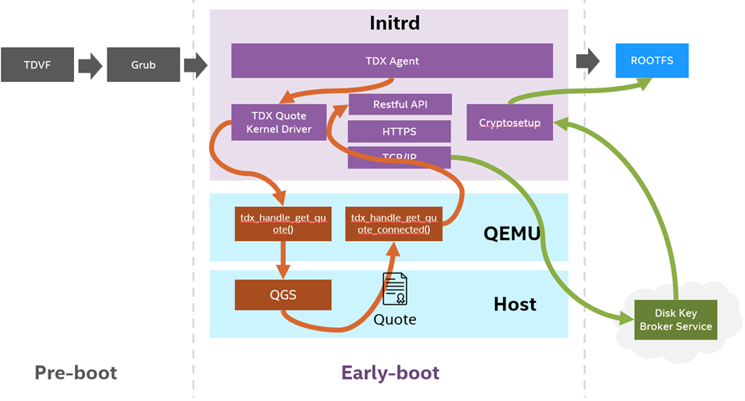

# TDX Full Disk Encryption

Full disk encryption (FDE) is a security method for protecting sensitive
data by encrypting all data on a disk partition. FDE shall encrypt data
automatically to prevent unauthorized access.
This project is a FDE solution based on [Intel&reg; Trust Domain 
Extensions(Intel TDX)](https://www.intel.com/content/www/us/en/developer/articles/technical/intel-trust-domain-extensions.html)
and [Project Amber](https://www.intel.com/content/www/us/en/security/project-amber.html).

## Architecture


  
## Preparation

### TDX tools

The source code of TDX full-disk encryption is placed in the `attestaion/full-disk-encryption`, which will be represented by `FDE_DIR` for convenience. 

The script `start-qemu.sh` in this repo wraps the `qemu` to help launch a FDE TDX guest. 

### Build the FDE agent

The FDE agent is repsonsible for retrieve the quote and send it to the Amber to fetch the key encrypted the image. The building steps are described in [README.md](../attestation/full-disk-encryption/README.md) in `FDE_DIR`. Read and follow the guide. 

The FDE agent depends on the dynamic library `libtdx-attest.so` from DCAP package, make sure that the library is installed in the guest image and duplicated to the initramfs.

### Create FDE image

There are servaral ways to create FDE image
- Follow the [wiki page](https://help.ubuntu.com/community/Full_Disk_Encryption_Howto_2019)
in Ubuntu community, and then install FDE agent and initramfs-tools
- Using the script in this repo

To use the script in the `FDE_DIR`, just run it with root permission
```
cd ${FDE_DIR}/tools/image
sudo ./tdx_guest_encrypted.sh
```

After creating the FDE image, the option `cryptdevice` should be appended in the kernel command (refer [link](https://wiki.archlinux.org/title/dm-crypt/System_configuration))
and then update the Grub config.

```
grub-install /dev/vda
grub-mkconfig -o /boot/grub/grub.cfg
```

*Notes: FDE agent check `cryptdevice` to get the encrypted device.*

### Enroll variables to OVMF

Install ovmfkeyenroll tool, refer https://github.com/intel/tdx-tools/tree/main/utils/ovmfkeyenroll

```
pip3 install ovmfkeyenroll
```

Enroll Key Broker Service (KBS) infomation to OVMF

1. KBS URL

```
NAME="KBSURL"
GUID="0d9b4a60-e0bf-4a66-b9b1-db1b98f87770"
DATA="url.txt"
python3 tools/image/enroll-vars.py -i OVMF.fd -o OVMF_FDE.fd -n $NAME -g $GUID -d $DATA
```

2. KBS Certificate

```
NAME="KBSCert"
GUID="d2bf05a0-f7f8-41b6-b0ff-ad1a31c34d37"
DATA="cert.cer"
python3 tools/image/enroll-vars.py -i OVMF_FDE.fd -o OVMF_FDE.fd -n $NAME -g $GUID -d $DATA
```

3. KBS User Data

```
NAME="KBSUserData"
GUID="732284dd-70c4-472a-aa45-1ffda02caf74"
DATA="userdata.txt"
python3 tools/image/enroll-vars.py -i OVMF_FDE.fd -o OVMF_FDE.fd -n $NAME -g $GUID -d $DATA
```


## Validation

Launch a TDX guest and verify encryption status.

Launch a tdvm guest by the following command. The `MROWNERCONFIG` is a 48*2 bytes sha384 hex string, derived from value `2`. It will be passed to guest by `mrownerconfig=${MROWNERCONFIG}`. In your env, you need to pass a customized `MROWNERCONFIG` that can be used to generate an uuid to create a valid url to query the KBS, such as Amber. 

The url looks like `https://${url}/kbs/v1/keys/${keyid}/transfer`, where the `${url}` is enrolled in previous step, and the `${keyid}` is derived from `mrownerconfig` by uuid version 5 algorithm in the url namespace.

```

OVMF_PATH=/path/to/OVMF
IMAGE_PATH=/path/to/image
MROWNERCONFIG=d063457705d66d6f016e4cdd747db3af8d70ebfd36badd63de6c8ca4a9d8bfb5d874e7fbd750aa804dcaddae7eeef51e

start-qemu.sh \
    -b grub \
    -q tdvmcall \
    -o ${OVMF_PATH} \
    -i ${IMAGE_PATH} \
    -w ${MROWNERCONFIG}
```

Verify the encryption status by running the command in the tdvm guest.
```
blkid
```

The TYPE of encrypted partition should be `crypto_LUKS`

```
/dev/vda1: UUID="79c64ac3-c2c2-479b-bbd8-ea9c7d5cf29f" LABEL="cloudimg-rootfs-enc" TYPE="crypto_LUKS"
```
